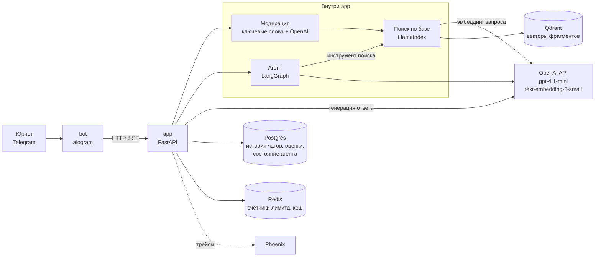
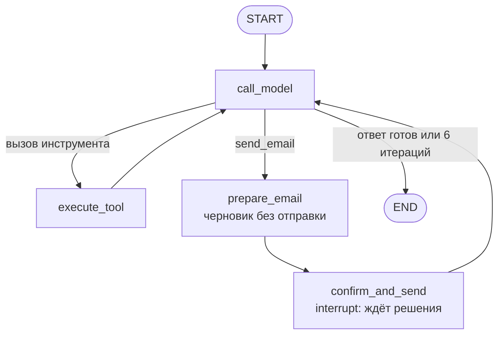

# ИИ-ассистент юриста по концессионным соглашениям

Telegram-бот, который отвечает на вопросы по концессионным соглашениям и внутренним регламентам компании. Ответ строится только по загруженным документам и сопровождается ссылкой на документ и пункт. Агентный режим умеет сравнивать несколько документов, составлять претензию и готовить письмо, которое уходит только после подтверждения человеком.

Дипломный проект курса «ИИ-разработчик: от API до агентов».

## Демонстрация

Видео (5 минут): https://disk.yandex.ru/i/4ypvkmOGP4f5Og

## Сценарии использования

Пользователь — юрист, который сопровождает концессионные проекты и договорную работу.

| Сценарий | Как вызвать | Пример |
|---|---|---|
| Вопрос на точный факт | Обычное сообщение | `Сколько стоит один штрафной балл по Ростовскому соглашению?` |
| Вопрос по другому документу | Обычное сообщение | `Какой срок действия соглашения по Вологде?` |
| Вопрос по внутренним правилам | Обычное сообщение | `Что запрещено делать при использовании ИИ?` |
| Сравнение нескольких документов | `/agent` | `/agent Сравни сроки действия соглашений по Ростову, Вологде и Дагестану` |
| Письмо с подтверждением | `/agent` | `/agent Найди штраф за просрочку ввода объекта по Ростову и отправь письмо на test@example.com` |
| Работа с новым документом | Отправить файл DOCX, PDF или TXT | Кнопки «Резюме», «Заключение», «Претензия» |
| Вопрос вне базы знаний | Обычное сообщение | `Какая ставка НДС в России?` — бот отвечает, что в базе этого нет |

Команды бота: `/start`, `/help`, `/agent <задача>`, `/clear` (очистить историю чата и память агента), `/cancel` (прервать текущее действие). Под ответами есть кнопки оценки 👍/👎. Администраторам доступны `/stats`, `/users`, `/broadcast`.

Выбора темы перед вопросом нет: поиск идёт по смыслу сразу по всей базе, а в каждом фрагменте сохранена шапка «папка · файл · раздел», по которой модель различает документы.

## Архитектура



Как проходит обычный вопрос:

1. Бот передаёт сообщение в `POST /chats/{id}/messages`.
2. Сообщение проходит модерацию; заблокированное возвращается с кодом 403.
3. Короткий уточняющий вопрос («а по Вологде?») переписывается в самостоятельный с учётом истории.
4. По запросу строится эмбеддинг, из Qdrant берутся 10 ближайших фрагментов, в модель уходят 5 лучших. Если задан ключ Cohere, порядок уточняет реранкер.
5. Если близость лучшего фрагмента ниже порога 0,3, контекст считается пустым и модель получает инструкцию ответить, что в базе ответа нет.
6. Ответ модели передаётся в бот потоком (SSE) и сохраняется в истории чата.

### Агент



Один агент с четырьмя инструментами:

| Инструмент | Что делает |
|---|---|
| `search_knowledge_base` | Возвращает фрагменты документов по запросу |
| `summarize_document` | Структурированное резюме текста: стороны, предмет, обязательства, сроки, риски |
| `format_claim` | Текст претензии по шаблону из переданных параметров |
| `send_email` | Отправка письма; выполняется только после нажатия «Отправить» в боте |

Состояние агента сохраняется в чекпоинтере (в Docker — Postgres), поэтому остановленный на подтверждении запуск возобновляется с того же места.

## База знаний

| Папка | Документы | Файлов |
|---|---|---|
| `concession-rostov` | Концессионное соглашение и 13 приложений | 14 |
| `concession-vologda` | Концессионное соглашение и 13 приложений | 14 |
| `concession-dagestan` | Концессионное соглашение | 1 |
| `policy-AI` | Правила и регламенты по использованию ИИ | 8 |
| `Договорная работа МВС`, `Договорная работа Урбантех` | Положения о договорной работе | 2 |

Всего 39 файлов DOCX, в Qdrant — 1221 фрагмент. В репозитории опубликованы только папки `concession-rostov` и `concession-vologda`; остальные документы внутренние и в репозиторий не входят.

Документы режутся не по длине, а по структуре: границы фрагмента совпадают с границами пунктов и разделов, таблица не разрывается посередине строки, а шапка таблицы повторяется в каждом её фрагменте. Размер фрагмента — до 1800 символов. Код: [app/services/legal_chunker.py](app/services/legal_chunker.py).

## Запуск

Нужны Docker и [uv](https://docs.astral.sh/uv/) (Python 3.11+ для индексации документов).

```bash
# 1. Настройки: заполнить ключ OpenAI, токен бота и секреты
cp .env.example .env

# 2. Хранилища
docker compose up -d qdrant postgres redis phoenix

# 3. Таблицы в Postgres
docker compose run --rm app alembic upgrade head

# 4. Индексация документов из data/ в Qdrant
uv sync
uv run python scripts/ingest.py data/

# 5. Сервис и бот
docker compose up -d --build
```

Шаги 2–4 выполняются один раз. Дальше стек поднимается одной командой `docker compose up -d`.

Сервис `app` не стартует, пока в Qdrant нет коллекции `rag_legal_v2`, поэтому индексация идёт до запуска сервиса.

| Сервис | Адрес |
|---|---|
| API и Swagger | http://localhost:8000/docs |
| Phoenix (трейсы) | http://localhost:6006 |
| Qdrant | http://localhost:6333/dashboard |

## Прокси и доступ к сети

Системе нужен доступ к `api.openai.com` и `api.telegram.org`.

**Скрипты на хосте** (`scripts/ingest.py`, `eval/run_qa.py`) читают прокси из переменных окружения. В PowerShell его включает [proxy.ps1](proxy.ps1) — адрес в файле нужно заменить на свой:

```powershell
. .\proxy.ps1
```

Скрипт задаёт `HTTPS_PROXY`, `HTTP_PROXY`, `ALL_PROXY` и `NO_PROXY=localhost,127.0.0.1,qdrant`, чтобы запросы к локальному Qdrant шли мимо прокси. Действует только в текущем окне терминала.

**Контейнеры** прокси-переменные не используют: клиенты OpenAI для чата и агента и клиент бота создаются с `trust_env=False`. Доступ к OpenAI и Telegram должен быть на уровне системы — например, VPN в режиме TUN или прокси в настройках Docker Desktop.

Если бот запущен, но не отвечает, в логах `docker logs llm-bot` будет `Cannot connect to host api.telegram.org` — это сеть, а не ошибка кода; бот переподключается сам.

## Переменные окружения

Полный список с заглушками — в [.env.example](.env.example).

| Переменная | Обязательна | Назначение |
|---|---|---|
| `LLM__OPENAI_API_KEY` | да | Ключ OpenAI: чат-модель, эмбеддинги, модерация |
| `BOT_TOKEN` | да | Токен Telegram-бота от @BotFather |
| `INTERNAL_TOKEN` | да | Общий секрет для запросов между сервисом и ботом |
| `ADMIN_TOKEN` | да | Токен доступа к admin API |
| `QDRANT_API_KEY` | да | Ключ доступа к Qdrant, любая строка |
| `LLM__DEFAULT_MODEL` | нет | Модель агента, по умолчанию `gpt-4.1-mini` |
| `LLM__REQUEST_TIMEOUT` | нет | Таймаут запроса к модели, секунды |
| `EMBEDDING_MODEL`, `EMBEDDING_DIM` | нет | Модель эмбеддингов и размерность вектора |
| `BOT_ADMIN_IDS` | нет | Telegram ID администраторов, JSON-список |
| `REDIS_URL`, `DATABASE_URL`, `QDRANT_URL` | нет | Адреса хранилищ для запуска без Docker; в Docker заданы в `compose.yaml` |
| `QDRANT_COLLECTION` | нет | Служебная коллекция из учебных блоков, создаётся при старте сервиса |
| `CHAT_REPOSITORY` | нет | Где хранить историю чатов: `postgres` или `json` |
| `CHAT_STORAGE_DIR` | нет | Папка для истории при `CHAT_REPOSITORY=json` |
| `SIMILARITY_TOP_K` | нет | Сколько фрагментов брать из Qdrant, по умолчанию 10 |
| `RAG_SCORE_THRESHOLD` | нет | Порог близости, ниже которого контекст считается пустым |
| `CHUNK_SIZE`, `CHUNK_OVERLAP` | нет | Используются только учебными экспериментами по чанкингу |
| `RATE_LIMIT_PER_MIN` | нет | Лимит запросов в минуту на `/chat` и `/chat/stream` |
| `LOG_LEVEL`, `CORS_ORIGINS` | нет | Уровень логов и разрешённые источники CORS |
| `COHERE_API_KEY` | нет | Включает реранкер Cohere |
| `USE_OPENAI_MODERATION` | нет | Модерация входящих сообщений через OpenAI, по умолчанию включена |
| `AGENT_CHECKPOINTER` | нет | Память агента: `sqlite`, `postgres` или `memory` |
| `HTTPS_PROXY` | нет | Прокси для скриптов на хосте |

## Качество

Проверочный набор — 16 вопросов по документам с эталонными фактами: [eval/qa_set.json](eval/qa_set.json). По каждому вопросу проверяются две вещи: попал ли нужный фрагмент в контекст модели и есть ли в ответе бота правильные цифры.

| Проверка | Результат |
|---|---|
| Нужный фрагмент в контексте | 12 из 13 |
| Правильный ответ бота | 15 из 16 |

Прогон от 24.09.2026: [eval/runs/qa_2026-09-24_1456.json](eval/runs/qa_2026-09-24_1456.json). Три вопроса не имеют эталонного фрагмента (два агентных и вопрос вне базы), поэтому поиск считается по 13.

Повторить при запущенном стеке:

```bash
uv run python eval/run_qa.py
```

## Наблюдаемость и защита

- **Трейсинг.** Вызовы модели и поиска уходят в Phoenix, проект `rag-legal-v2`.
- **Логи.** Структурированные, с `request_id` на каждый запрос; в записях о заблокированных сообщениях персональные данные маскируются.
- **Модерация.** Входящие сообщения чата проверяются по списку ключевых слов ([moderation_keywords.yaml](moderation_keywords.yaml)) и через OpenAI Moderation; ответы — по ключевым словам.
- **Хранение.** История чатов и состояние агента лежат в Postgres.

## Тесты

```bash
uv run pytest
```

Сейчас проходят 43 теста из 62: 11 падают, 3 завершаются ошибкой, 5 пропускаются. Не проходят тесты ранних учебных блоков, которые не обновлялись после переработки бота, чата и замены корпуса.

## Ограничения

- **Сканы.** PDF без текстового слоя не читаются, OCR нет.
- **Отправка письма.** `send_email` имитируется: письмо пишется в лог сервиса, почтовый сервер не подключён.
- **Один провайдер модели.** Запасной модели нет: при недоступности OpenAI бот сообщает об ошибке.
- **Модерация и лимит.** Режим `/agent` не проходит модерацию; ограничение частоты действует на `/chat` и `/chat/stream`, но не на запросы бота.
- **Загруженный файл.** Используются первые 12 000 символов; из DOCX берутся абзацы без таблиц.
- **Ожидание подтверждения.** Бот хранит его в памяти процесса: после перезапуска бота кнопки под старым письмом не сработают.
- **TLS.** Бот подключается к Telegram без проверки сертификата.
- **Поиск.** На один вопрос проверочного набора нужный фрагмент не находится, и ответ неверный: «На сколько лет заключено концессионное соглашение в Вологодской области?». Нужный фрагмент находится на 7-м месте из 10, а в модель уходят первые 5; тот же вопрос в формулировке «Какой срок действия соглашения по Вологде?» отвечается правильно.

## Документация

| Документ | Содержание |
|---|---|
| [docs/architecture.md](docs/architecture.md) | Архитектура: компоненты, путь запроса, хранение, поведение при сбоях |
| [docs/agent-graph.md](docs/agent-graph.md) | Схема агентного графа, узлы, инструменты, подтверждение человеком |
| [docs/search-quality.md](docs/search-quality.md) | Отчёт по качеству поиска и ответов на рабочем корпусе |
| [docs/decisions.md](docs/decisions.md) | Итоговое описание решений: что выбрано, из чего и почему |

Материалы учебных блоков, на которые опираются решения:

| Документ | Содержание |
|---|---|
| [docs/multi-agent-report.md](docs/multi-agent-report.md) | Сравнение с мультиагентной схемой и отказ от неё |
| [docs/agent-persistent-report.md](docs/agent-persistent-report.md) | Агент с сохранением состояния и подтверждением |
| [docs/chunking_experiment.md](docs/chunking_experiment.md), [docs/rag_evaluation.md](docs/rag_evaluation.md) | Эксперименты по чанкингу и метрики на учебном корпусе |
| [docs/vector_store.md](docs/vector_store.md) | Выбор метрики и фильтры в Qdrant |
| [docs/security/](docs/security/) | Проверка устойчивости к промпт-инъекциям |
| [docs/architecture-initial.md](docs/architecture-initial.md) | Ранний проект архитектуры |
| [docs/course-blocks.md](docs/course-blocks.md) | Журнал учебных блоков |
