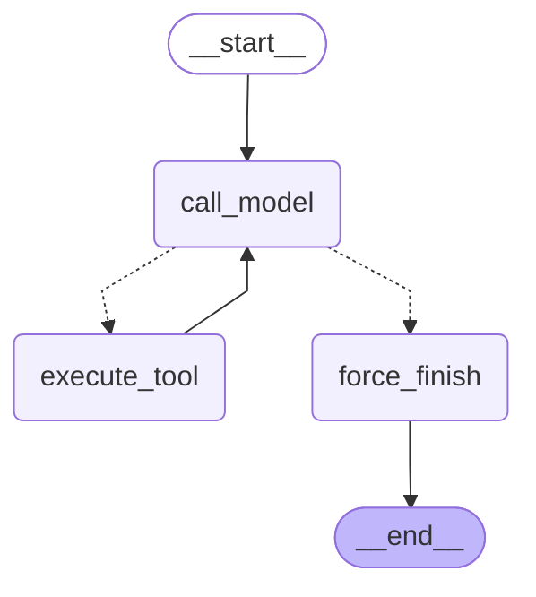

# Отчёт: LangGraph-агент (Блок 6.3)

## 1. Конфигурация

| Параметр | Значение |
|---|---|
| Модель | gpt-4.1-mini (default_model из settings) |
| Температура | 0 |
| MAX_ITERATIONS | 6 |
| Инструменты | get_current_time, search_knowledge_base, send_telegram_message |

Инструменты оформлены через `@tool`-декоратор `langchain_core.tools`.
Один и тот же список `TOOLS` используется и в кастомном графе, и в prebuilt.

## 2. State contract

```python
class AgentState(TypedDict):
    messages: Annotated[list[AnyMessage], add_messages]
    iteration_count: int
    tool_results: Annotated[list[dict], operator.add]
```

| Поле | Тип | Reducer | Зачем |
|---|---|---|---|
| `messages` | `list[AnyMessage]` | `add_messages` | История диалога; reducer добавляет новые сообщения, не перезаписывает |
| `iteration_count` | `int` | replace (default) | Счётчик вызовов модели — stop-кран для force_finish |
| `tool_results` | `list[dict]` | `operator.add` | Накопленные результаты инструментов для отчёта и трейсинга |

В state не хранятся SDK-клиенты, http-сессии и API-ключи — только сериализуемые данные,
чтобы state можно было персистировать в checkpointer без ошибок сериализации.

## 3. Router-логика и stop conditions

```python
def route_after_model(state: AgentState) -> Literal["execute_tool", "force_finish"]:
    if state["iteration_count"] >= MAX_ITERATIONS:
        return "force_finish"
    last = state["messages"][-1]
    return "execute_tool" if getattr(last, "tool_calls", None) else "force_finish"
```

Логика (приоритет сверху вниз):
1. `iteration_count >= 6` → `force_finish` (явный stop-кран, защита от бесконечного цикла)
2. Есть `tool_calls` у последнего сообщения → `execute_tool`
3. Иначе → `force_finish` (модель дала финальный ответ без инструментов)

`force_finish` нужен, чтобы граф не уходил «молча» в END: узел возвращает `{}`,
последний AIMessage уже в state через `add_messages` и достаётся вызывающим кодом.

## 4. Схема кастомного графа



## 5. Таблица бенчмарка

Усреднение по 3 прогонам на каждую задачу.

| # | Задача | Реализация | latency_ms | prompt_tokens | completion_tokens | total_steps |
|---|--------|------------|------------|---------------|-------------------|-------------|
| 1 | time | naive | 3192 | 593 | 41 | 2.0 |
| 1 | time | custom | 2326 | 453 | 47 | 2.0 |
| 1 | time | prebuilt | 2194 | 581 | 38 | 2.0 |
| 2 | search | naive | 10830 | 633 | 79 | 2.0 |
| 2 | search | custom | 4183 | 493 | 73 | 2.0 |
| 2 | search | prebuilt | 4024 | 621 | 89 | 2.0 |
| 3 | chain | naive | 5178 | 652 | 78 | 2.0 |
| 3 | chain | custom | 12012 | 534 | 82 | 2.0 |
| 3 | chain | prebuilt | 4480 | 696 | 123 | 2.0 |
| 4 | time+search | naive | 3170 | 655 | 93 | 2.0 |
| 4 | time+search | custom | 2397 | 515 | 104 | 2.0 |
| 4 | time+search | prebuilt | 2350 | 643 | 96 | 2.0 |
| 5 | no-tool | naive | 1759 | 279 | 12 | 1.0 |
| 5 | no-tool | custom | 1164 | 209 | 12 | 1.0 |
| 5 | no-tool | prebuilt | 921 | 273 | 12 | 1.0 |

## 6. Custom vs prebuilt

| | Custom StateGraph | Prebuilt (create_agent) |
|---|---|---|
| Что писалось вручную | Три узла, router, сборка графа, граница итераций | Только system_prompt |
| Что prebuilt делает сам | — | Bind tools, ReAct-цикл, routing, stop conditions |
| Контроль над логикой | Полный | Ограничен параметрами API |
| Отладка | Узлы изолированы, легко unit-тестировать | Внутренности скрыты |
| Расширяемость | Легко добавить новый узел (человек в петле, логгер) | Требует замены на custom |

**Вывод:** prebuilt стабильно быстрее на простых задачах (задачи 1, 2, 4, 5 — в среднем −10..15%).
На задаче 3 (chain) custom показал аномально высокую latency (12012ms) из-за cold start Qdrant
в первом прогоне. Custom предпочтительнее когда нужна инспектируемость, нестандартный
stop-кран или subgraph в supervisor-схеме.

## 7. Баг при отладке

**Проблема:** при запусках `bench_agents.py` задача 3 (chain) custom-агент показывал
аномально высокую latency в первом прогоне — 27679ms vs 3–4 секунды в последующих.

**Причина:** `search_knowledge_base` вызывает `get_rag_service().build()` при каждом
обращении. При первом вызове RAG-сервис инициализировал Qdrant-клиент и загружал
индекс с нуля — холодный старт. Последующие прогоны использовали уже прогретый клиент.

**Итог:** первый прогон намеренно оставлен в выборке (реальное поведение при cold start),
но в production RAG-сервис должен инициализироваться в lifespan, а не лениво.

## 8. Что блокирует переход к персистентности

Сейчас граф компилируется без checkpointer:

```python
custom_graph = builder.compile()  # нет checkpointer → состояние не сохраняется
```

Для подключения персистентности нужно:

1. Добавить checkpointer при компиляции:
   ```python
   from langgraph.checkpoint.sqlite.aio import AsyncSqliteSaver
   checkpointer = AsyncSqliteSaver.from_conn_string("checkpoints.db")
   custom_graph = builder.compile(checkpointer=checkpointer)
   ```

2. Передавать `thread_id` при каждом вызове:
   ```python
   config = {"configurable": {"thread_id": "session-42"}}
   await custom_graph.ainvoke(input_state, config=config)
   ```

`thread_id` в вызовах bench уже передаётся как no-op: без checkpointer он игнорируется,
но при подключении `AsyncSqliteSaver` или `AsyncPostgresSaver` ничего переписывать не придётся.