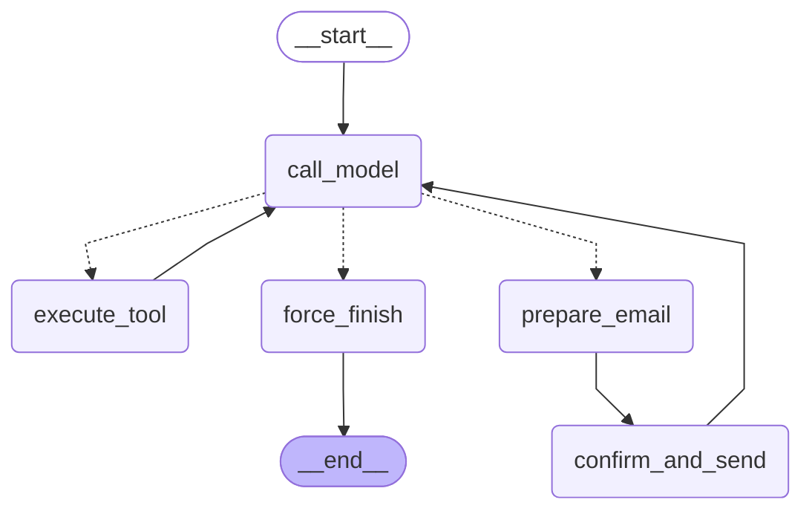
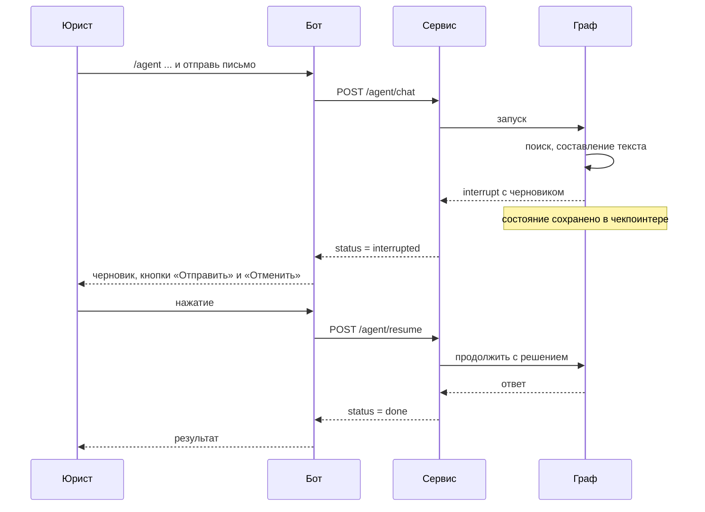

# Граф агента

Агент — один граф LangGraph с циклом «модель → инструмент → модель» и отдельной веткой для отправки письма. Код: [app/services/agent_persistent.py](../app/services/agent_persistent.py).

## Схема

Диаграмма получена из скомпилированного графа вызовом `graph.get_graph().draw_mermaid()`.

## Узлы

| Узел | Что делает |
|---|---|
| `call_model` | Вызывает модель с системной инструкцией и историей; увеличивает счётчик итераций |
| `execute_tool` | Выполняет запрошенные моделью инструменты, кроме `send_email` |
| `prepare_email` | Собирает черновик письма из аргументов вызова. Ничего не отправляет, поэтому безопасен при повторе |
| `confirm_and_send` | Останавливает граф через `interrupt()` и ждёт решения; отправляет письмо только при согласии |
| `force_finish` | Завершает работу: ответ уже лежит в истории сообщений |

## Маршрутизация после модели

Проверки идут по порядку:

1. Сделано 6 вызовов модели — завершение. Это защита от зацикливания.
2. Модель не запросила инструмент — завершение, её сообщение и есть ответ.
3. Среди запрошенных инструментов есть `send_email` — ветка подтверждения.
4. Иначе — выполнение инструментов и новый вызов модели.

## Инструменты

| Инструмент | Меняет внешнее состояние | Что делает |
|---|---|---|
| `search_knowledge_base(query)` | нет | Возвращает до 5 фрагментов документов по запросу или сообщение, что ничего не найдено |
| `summarize_document(text)` | нет | Отдельным вызовом модели строит резюме: стороны, предмет, обязательства, сроки, риски |
| `format_claim(claimant, respondent, subject, amount, grounds)` | нет | Подставляет параметры в шаблон претензии; модель не вызывается |
| `send_email(to, subject, body)` | да | Отправка письма после подтверждения |

Системная инструкция требует: на любой вопрос о документах сначала вызывать поиск, отвечать только по найденным фрагментам, указывать документ и пункт, для претензии сначала найти условия договора, а письмо отправлять только по прямой просьбе пользователя.

## Подтверждение человеком

Отправка разнесена на два узла намеренно. Узел с `interrupt()` при возобновлении выполняется заново с начала, поэтому всё, что стоит в нём до точки остановки, должно быть безопасно при повторе. Подготовка черновика вынесена в отдельный узел, а в `confirm_and_send` до `interrupt()` нет действий с побочным эффектом.

## Состояние

| Поле | Назначение |
|---|---|
| `messages` | История диалога и вызовов инструментов |
| `iteration_count` | Число вызовов модели в текущем запуске |
| `tool_results` | Журнал выполненных инструментов: имя, аргументы, результат |
| `draft` | Черновик письма, ожидающий решения |
| `sent` | Было ли письмо отправлено |

Состояние сохраняется чекпоинтером после каждого узла. Ключ — `thread_id`; бот использует `agent-tg-<id чата>` для команды `/agent` и `doc-tg-<id чата>` для загруженных файлов. Команда `/clear` удаляет историю команды `/agent` для чата.

Хранилище выбирается переменной `AGENT_CHECKPOINTER`: `postgres` в Docker, `sqlite` при локальном запуске, `memory` в тестах.

## Ограничения

- **Отправка имитируется.** Функция отправки пишет адресата и тему в лог сервиса; почтовый сервер не подключён.
- **Нет модерации.** Текст задачи для агента не проходит проверку, которая есть у обычных сообщений.
- **Кнопки живут в памяти бота.** После перезапуска бота нажатие под старым черновиком не обрабатывается, хотя состояние графа в Postgres сохранено.
- **Заключение без инструмента.** Кнопка «Заключение» для загруженного файла формулирует задачу агенту; отдельного инструмента для заключений нет, ответ пишет сама модель.
