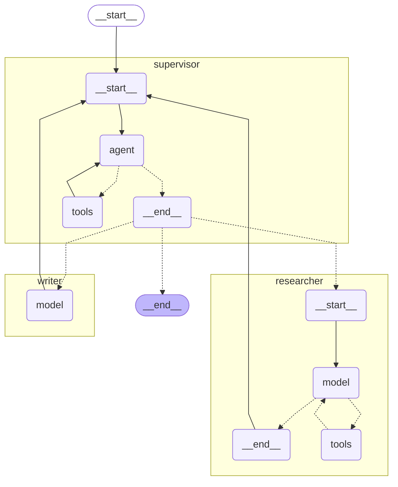

# Архитектура мультиагентной системы

```mermaid
---
config:
  flowchart:
    curve: linear
---
graph TD;
	__start__([<p>__start__</p>]):::first
	__end__([<p>__end__</p>]):::last
	__start__ --> supervisor\3a__start__;
	researcher\3a__end__ --> supervisor\3a__start__;
	supervisor\3a__end__ -.-> __end__;
	supervisor\3a__end__ -.-> researcher\3a__start__;
	supervisor\3a__end__ -.-> writer\3amodel;
	writer\3amodel --> supervisor\3a__start__;
	subgraph supervisor
	supervisor\3a__start__(<p>__start__</p>)
	supervisor\3aagent(agent)
	supervisor\3atools(tools)
	supervisor\3a__end__(<p>__end__</p>)
	supervisor\3a__start__ --> supervisor\3aagent;
	supervisor\3aagent -.-> supervisor\3a__end__;
	supervisor\3aagent -.-> supervisor\3atools;
	supervisor\3atools --> supervisor\3aagent;
	end
	subgraph researcher
	researcher\3a__start__(<p>__start__</p>)
	researcher\3amodel(model)
	researcher\3atools(tools)
	researcher\3a__end__(<p>__end__</p>)
	researcher\3a__start__ --> researcher\3amodel;
	researcher\3amodel -.-> researcher\3a__end__;
	researcher\3amodel -.-> researcher\3atools;
	researcher\3atools -.-> researcher\3amodel;
	end
	subgraph writer
	writer\3amodel(model)
	end
	classDef default fill:#f2f0ff,line-height:1.2
	classDef first fill-opacity:0
	classDef last fill:#bfb6fc

```
