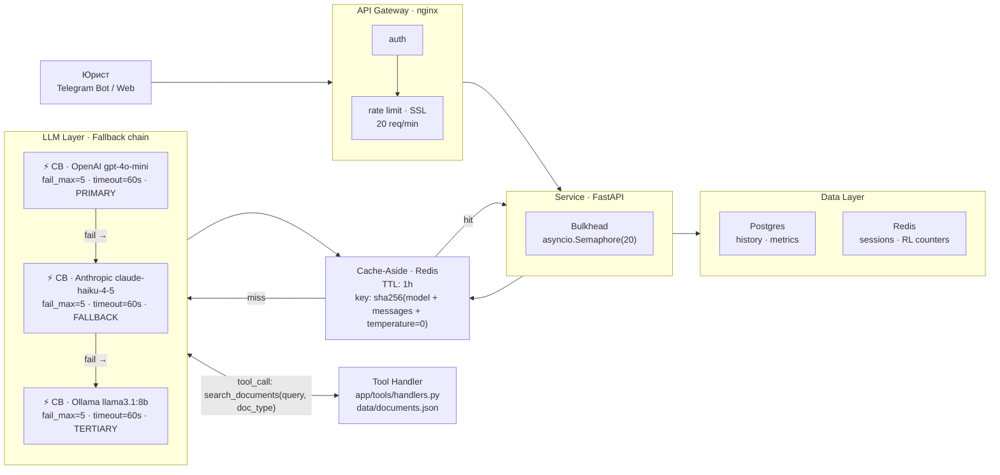

# Архитектура rag-legal-v2

## Диаграмма компонентов

## ADR-001: Выбор паттерна взаимодействия

**Status:** Accepted (2026-08-15)

**Context.**
Проект — ИИ-ассистент для анализа юридических документов. Интерфейс —
Telegram-бот (М4) и Web API. Ожидаемая нагрузка: 10–30 RPM в пике,
средний ответ — 500–800 токенов (5–10 сек генерации), бюджет ~$5/день. 
TPM: ~45K (30 RPM × ~1500 токенов на запрос).
Целевой cache hit rate: 15–20% (юридические запросы разнообразны,
точные повторы редки)..
Архитектура включает tool_call цикл: LLM вызывает `search_documents`,
получает фрагменты документов, затем синтезирует финальный ответ.

**Decision.**
Выбран **Request-Response**. Tool_call цикл требует полного intermediate
response перед финальной генерацией — потоковая передача здесь усложнила бы
логику без выигрыша для пользователя. Юристы работают вдумчиво: 5–10 секунд
ожидания полного ответа приемлемы, а частичный текст без результатов поиска
создал бы путаницу.

**Consequences.**
- Плюсы: простая реализация, tool_call цикл работает «из коробки», легко
  логировать полный запрос/ответ для аудита (важно в юридическом контексте).
- Минусы: пользователь ждёт без обратной связи — нужен индикатор загрузки
  на стороне Telegram-бота («⏳ Анализирую документы...»).

**Alternatives considered.**
- Streaming — отвергнут на текущем этапе: в предыдущей версии проекта
  наблюдалось поведение «несколько токенов → пауза на tool_call → остаток
  текста», что хуже простого индикатора загрузки. Вернём при реализации
  Telegram-бота (М4), когда tool_call будет вынесен отдельно.

- Queue-based — отвергнут: избыточно для интерактивного запроса при
  нагрузке 10–30 RPM; добавляет worker'ы и polling без реальной нужды.

  ## ADR-002: Стратегия fault tolerance

**Status:** Accepted (2026-08-15)

**Decision.**
- Primary: OpenAI `gpt-4o-mini` — баланс цена/качество для юридических текстов.
- Fallback: Anthropic `claude-haiku-4-5` — надёжный резерв, сопоставимая цена.
- Tertiary: Ollama `llama3.1:8b` (local) — на случай полного отказа облаков.

Circuit Breaker: `aiobreaker`, **по одному на провайдера**,
`fail_max=5`, `timeout_duration=60s`.

Cache-Aside: Redis, TTL 1h, ключ — `sha256(model + messages + temperature=0)`.
Кешируем только при `temperature=0` — детерминированные запросы.

**Consequences.**
- Сервис остаётся доступным при одновременном падении OpenAI + Anthropic
  (Ollama держит UX в ограниченном режиме).
- Три отдельных CB не дают падению одного провайдера открывать CB другого.
- Дополнительные расходы: ~$1–2/мес на Anthropic-трафик (только при failover)
  + self-hosted Ollama на VPS.

**Alternatives considered.**
- Один CB на все провайдеры — отвергнут: падение OpenAI открыло бы CB
  и для Anthropic, лишая смысла весь fallback chain.
- Только два провайдера (без Ollama) — отвергнут: при одновременном сбое
  облаков сервис полностью недоступен, что неприемлемо для юридического
  инструмента.

  ## Потенциальные точки отказа

| Слой | Что произойдёт | Паттерн защиты | Graceful degradation |
|---|---|---|---|
| **API Gateway** | nginx недоступен — клиент не достучится до сервиса | Rate limit защищает от перегрузки до отказа | 503 с `Retry-After: 30`; Telegram-бот показывает «Сервис временно недоступен» |
| **Service** | FastAPI упал или перегружен | Bulkhead (`Semaphore`) ограничивает параллельные запросы | 503 новым запросам; текущие обрабатываются до конца |
| **LLM** | Все провайдеры недоступны | Fallback chain (OpenAI → Anthropic → Ollama) + Circuit Breaker на каждом | Ollama отвечает локально; если и он упал — шаблонный ответ: «Не могу проанализировать документ прямо сейчас. Попробуйте через несколько минут.» |
| **Data** | Redis недоступен | Cache-Aside: miss не ломает запрос, просто идём в LLM | Запросы проходят без кеша (дороже и медленнее); Postgres недоступен — история не сохраняется, но ответ пользователь получает |