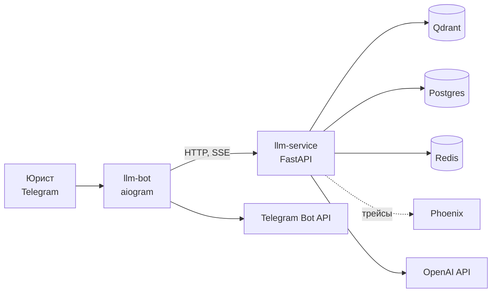
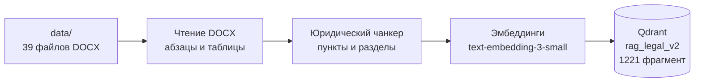
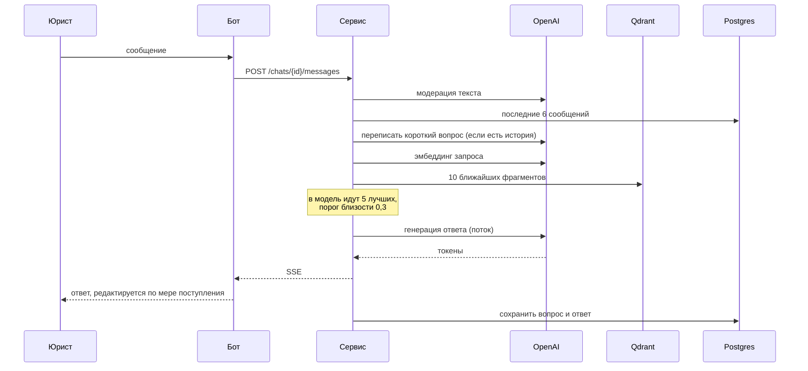

# Архитектура

Документ описывает систему в том виде, в котором она сдаётся. Ранний проект архитектуры с нереализованными частями сохранён в [architecture-initial.md](architecture-initial.md).

## Компоненты

Стек из шести контейнеров, описан в [compose.yaml](../compose.yaml).

| Контейнер | Что это | Зачем |
|---|---|---|
| `llm-bot` | Telegram-бот на aiogram | Принимает сообщения и файлы, показывает ответы и кнопки |
| `llm-service` | Сервис на FastAPI | Чат, поиск по базе знаний, агент, модерация, admin API |
| `llm-qdrant` | Qdrant | Векторы фрагментов документов |
| `llm-postgres` | Postgres 16 | История чатов, оценки ответов, состояние агента |
| `llm-redis` | Redis | Счётчики лимита запросов, кеш ответов учебного эндпоинта `/chat` |
| `llm-phoenix` | Arize Phoenix | Трейсы вызовов модели и поиска |

Внешние сервисы: OpenAI API (чат-модель `gpt-4.1-mini`, эмбеддинги `text-embedding-3-small`, модерация) и Telegram Bot API.

```mermaid
flowchart LR
    U["Юрист<br/>Telegram"] --> BOT["llm-bot<br/>aiogram"]
    BOT -->|HTTP, SSE| APP["llm-service<br/>FastAPI"]

    APP --> QD[("Qdrant")]
    APP --> PG[("Postgres")]
    APP --> RD[("Redis")]
    APP -.трейсы.-> PH["Phoenix"]
    APP --> OAI["OpenAI API"]
    BOT --> TG["Telegram Bot API"]
```

## Индексация документов

Выполняется один раз скриптом [scripts/ingest.py](../scripts/ingest.py) с хоста, вне контейнеров.

```mermaid
flowchart LR
    D["data/<br/>39 файлов DOCX"] --> R["Чтение DOCX<br/>абзацы и таблицы"]
    R --> C["Юридический чанкер<br/>пункты и разделы"]
    C --> E["Эмбеддинги<br/>text-embedding-3-small"]
    E --> Q[("Qdrant<br/>rag_legal_v2<br/>1221 фрагмент")]
```

1. **Чтение.** Абзацы идут отдельными строками, строки таблиц — ячейки через ` | `. Вложенные таблицы попадают в текст один раз.
2. **Нарезка.** Фрагмент состоит из целых пунктов до 1800 символов. Граница раздела и граница «текст / таблица» всегда закрывают фрагмент. Длинная таблица режется по строкам с повтором шапки. Фрагменты короче 500 символов приклеиваются к соседу в том же разделе.
3. **Шапка.** В начало каждого фрагмента добавляется строка `[папка · файл · Раздел: …]`. Она попадает и в эмбеддинг, и в контекст модели.
4. **Повторный запуск.** Скрипт ведёт реестр документов в `var/docstore.json`: изменённые файлы переиндексируются, удалённые убираются из Qdrant.

## Путь обычного вопроса

```mermaid
sequenceDiagram
    participant U as Юрист
    participant B as Бот
    participant A as Сервис
    participant O as OpenAI
    participant Q as Qdrant
    participant P as Postgres

    U->>B: сообщение
    B->>A: POST /chats/{id}/messages
    A->>O: модерация текста
    A->>P: последние 6 сообщений
    A->>O: переписать короткий вопрос (если есть история)
    A->>O: эмбеддинг запроса
    A->>Q: 10 ближайших фрагментов
    Note over A: в модель идут 5 лучших,<br/>порог близости 0,3
    A->>O: генерация ответа (поток)
    O-->>A: токены
    A-->>B: SSE
    B-->>U: ответ, редактируется по мере поступления
    A->>P: сохранить вопрос и ответ
```

Подробности по шагам:

- **Модерация.** Сначала список ключевых слов по пяти категориям, затем OpenAI Moderation. Заблокированное сообщение возвращается с кодом 403, бот показывает причину.
- **Уточняющие вопросы.** Вопрос из шести слов и короче при наличии истории переписывается в самостоятельный, чтобы «а по Вологде?» искалось как полный вопрос.
- **Отбор фрагментов.** Qdrant возвращает 10 фрагментов по косинусной близости, в модель уходят первые 5. Если задан `COHERE_API_KEY`, пятёрку отбирает реранкер; при его сбое используется исходный порядок.
- **Порог.** Если близость лучшего фрагмента ниже 0,3, контекст считается пустым. Модель получает инструкцию ответить, что в базе ответа нет, и не использовать общие знания.
- **Инструкция модели.** Отвечать только по контексту, после каждого факта указывать документ и номер пункта, номер пункта не придумывать, при фрагментах из разных договоров указывать, к какому относится каждый факт.
- **История.** До 20 последних сообщений передаются как есть, более старые сжимаются в краткое изложение отдельным запросом.

## Путь задачи для агента

Команда `/agent` идёт в `POST /agent/chat`. Граф агента и его узлы описаны в [agent-graph.md](agent-graph.md).

Если агент дошёл до отправки письма, сервис возвращает `status="interrupted"` с черновиком. Бот показывает черновик и кнопки; нажатие уходит в `POST /agent/resume`, и граф продолжается с сохранённого места.

## Загруженный файл

Бот сам извлекает текст из DOCX, PDF или TXT (до 10 МБ, первые 12 000 символов) и предлагает три действия. Выбранное действие превращается в задачу для агента: «резюмируй», «дай заключение» или «составь претензию» с текстом документа. Файл в базу знаний не добавляется.

## Хранение данных

| Что | Где | Комментарий |
|---|---|---|
| Векторы и текст фрагментов | Qdrant, коллекция `rag_legal_v2` | Том `qdrant_storage` |
| История чатов | Postgres, таблицы `chats`, `chat_messages` | Удаление мягкое, через `deleted_at` |
| Оценки 👍/👎 | Postgres | Таблицы создаются миграциями Alembic |
| Состояние агента | Postgres, таблицы чекпоинтера LangGraph | Создаются сервисом при старте |
| Ожидание нажатия кнопки | Память процесса бота | Теряется при перезапуске бота |
| Трейсы | Phoenix, том `phoenix_data` | Проект `rag-legal-v2` |

## Поведение при сбоях

| Что отказало | Что происходит | Что видит пользователь |
|---|---|---|
| OpenAI недоступен или отклоняет ключ, обычный вопрос | Ошибка поиска логируется, поток ответа прерывается без токенов | «Не удалось получить ответ. Попробуйте ещё раз.» |
| OpenAI недоступен, задача агенту | Запрос к сервису завершается ошибкой | «Произошла ошибка. Попробуйте позже.» |
| OpenAI Moderation недоступна | Ошибка логируется, сообщение пропускается дальше | Ничего; работает только проверка по ключевым словам |
| Реранкер Cohere недоступен | Используется порядок из Qdrant | Ничего |
| Qdrant недоступен во время работы | Поиск возвращает пустой контекст | Ответ, что в базе ничего не нашлось |
| Qdrant недоступен или коллекции нет при старте | Сервис не запускается | Сообщение об ошибке вместо ответа |
| Postgres недоступен | Запросы чата завершаются ошибкой | Сообщение об ошибке вместо ответа |
| Сервис отвечает на вопрос дольше 120 секунд | Бот прерывает ожидание | «Ответ занимает слишком долго» |
| Telegram недоступен | Бот повторяет подключение каждые несколько секунд | Сообщения доставляются после восстановления связи |
| Агент зациклился | Граф останавливается после 6 вызовов модели | Последний ответ модели |

Чего нет:

- **Запасного провайдера.** Вся генерация и все эмбеддинги идут через один аккаунт OpenAI. Блокировка аккаунта останавливает и ответы, и поиск.
- **Circuit breaker.** Каждый запрос пробует достучаться до OpenAI заново.
- **Различения «база недоступна» и «в базе нет ответа».** При отказе Qdrant пользователь получает тот же текст, что и при вопросе вне базы.

## Защита

- **Секреты.** Только в `.env`, который не попадает в git и в образ. Контейнер работает от непривилегированного пользователя.
- **Модерация.** Вход чата — ключевые слова и OpenAI Moderation; выход — ключевые слова. Режим `/agent` модерацию не проходит.
- **Ограничение частоты.** 30 запросов в минуту с одного адреса на учебных эндпоинтах `/chat` и `/chat/stream`. Запросы бота идут через `/chats/…` и `/agent/…` и этим лимитом не ограничены.
- **Опасное действие.** Отправка письма выполняется только после подтверждения человеком.
- **Admin API.** Закрыт токеном `ADMIN_TOKEN`; админ-команды бота доступны только ID из `BOT_ADMIN_IDS`.
- **Передача данных.** Вопросы и фрагменты документов уходят в облачный API OpenAI.

## Наблюдаемость

- **Трейсы.** Вызовы OpenAI и шаги поиска LlamaIndex отправляются в Phoenix (`http://localhost:6006`).
- **Логи.** JSON, в каждой записи `request_id`, путь и метод запроса.
- **Проверки состояния.** `/health` — сервис жив; `/ready` — доступен Redis.
