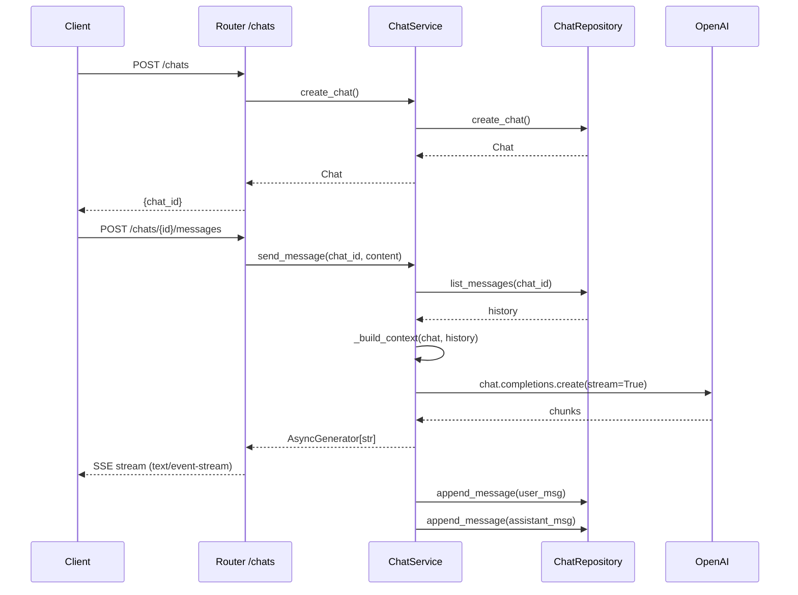

# Архитектура чата (Блок 4.1)

## Схема потока данных



## Hybrid context strategy

При каждом запросе `_build_context()` решает, как сформировать историю для LLM:

| Условие | Действие |
|---|---|
| `len(history) ≤ KEEP_RECENT (20)` | Все сообщения передаются как есть |
| `len(history) > KEEP_RECENT` | Старые сообщения сжимаются в саммари через отдельный LLM-запрос, последние 20 добавляются целиком |

**Почему не sliding window (просто последние N)?**  
Sliding window теряет контекст: если пользователь назвал своё имя в начале диалога, через 20 сообщений оно исчезнет. Hybrid strategy сохраняет семантику всей беседы через саммари, при этом не выходит за лимит токенов.

**Константы** (`app/chat/service.py`):
```python
CONTEXT_WINDOW = 128_000   # лимит модели
RESPONSE_TOKENS = 4_096    # резерв на ответ
SAFETY_MARGIN = 512        # буфер
KEEP_RECENT = 20           # последние сообщения без сжатия
```

## Хранилища

Выбирается через `.env`: `CHAT_REPOSITORY=json` или `CHAT_REPOSITORY=postgres`.

**JSON** (`var/chats/<chat_id>/`):
- `chat.json` — метаданные чата
- `messages.jsonl` — append-only лог сообщений
- soft delete: маркер `{"type": "soft_delete", "at": "..."}` в конце файла

**Postgres** (`app/chat/repositories/pg_models.py`):
- таблица `chats`, таблица `chat_messages`
- soft delete: `deleted_at TIMESTAMPTZ` (строки не удаляются)
- индекс: `ix_chat_messages_chat_created` с фильтром `WHERE deleted_at IS NULL`

## Примеры curl

```bash
# Создать чат
curl -X POST http://localhost:8000/chats \
  -H "Content-Type: application/json" \
  -d '{"owner_external_id": "user-1", "interface": "web"}'

# Отправить сообщение (SSE-стрим)
curl -X POST http://localhost:8000/chats/<chat_id>/messages \
  -H "Content-Type: application/json" \
  -d '{"content": "Что такое срок исковой давности?"}' \
  --no-buffer

# Получить историю
curl http://localhost:8000/chats/<chat_id>/messages

# Очистить историю (soft delete)
curl -X DELETE http://localhost:8000/chats/<chat_id>/messages

# Получить метаданные чата
curl http://localhost:8000/chats/<chat_id>
```

> В PowerShell вместо curl использовать `Invoke-WebRequest` или `curl.exe`.
